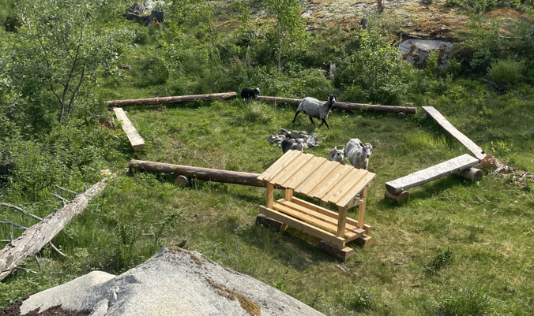
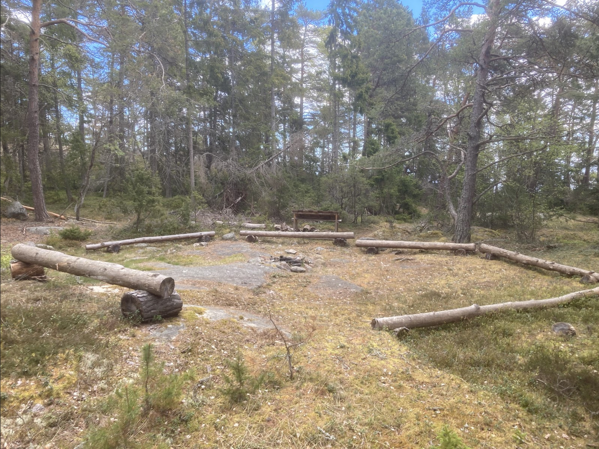
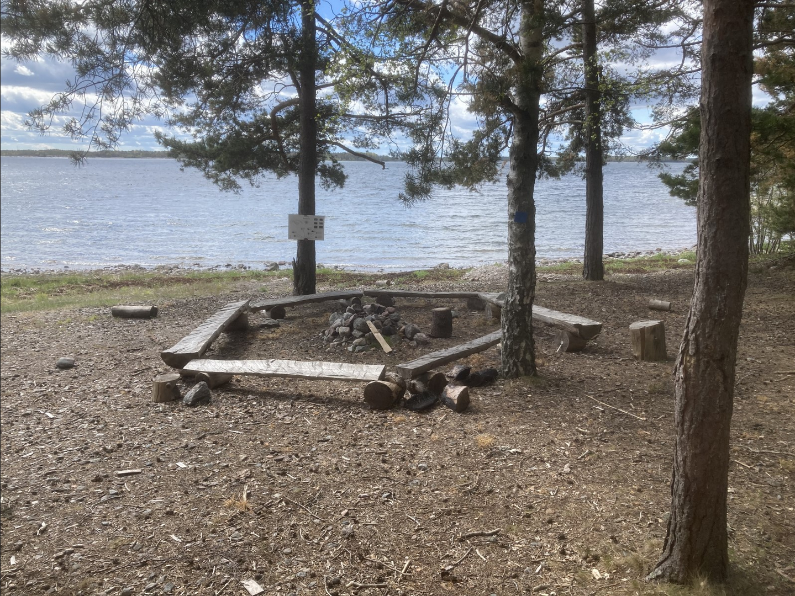
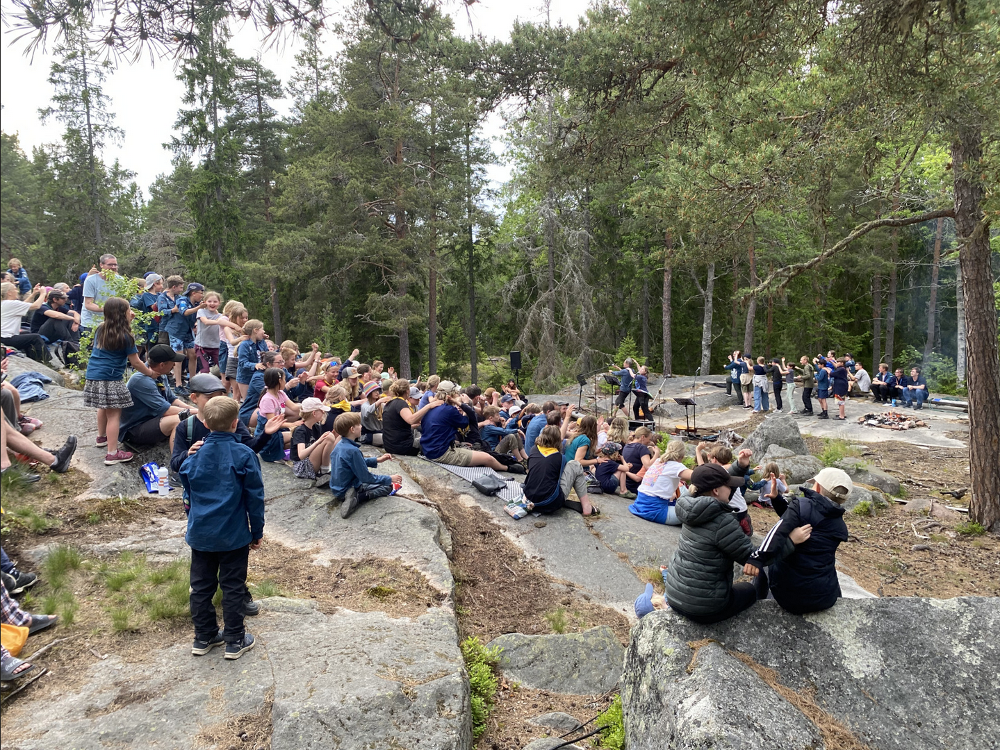
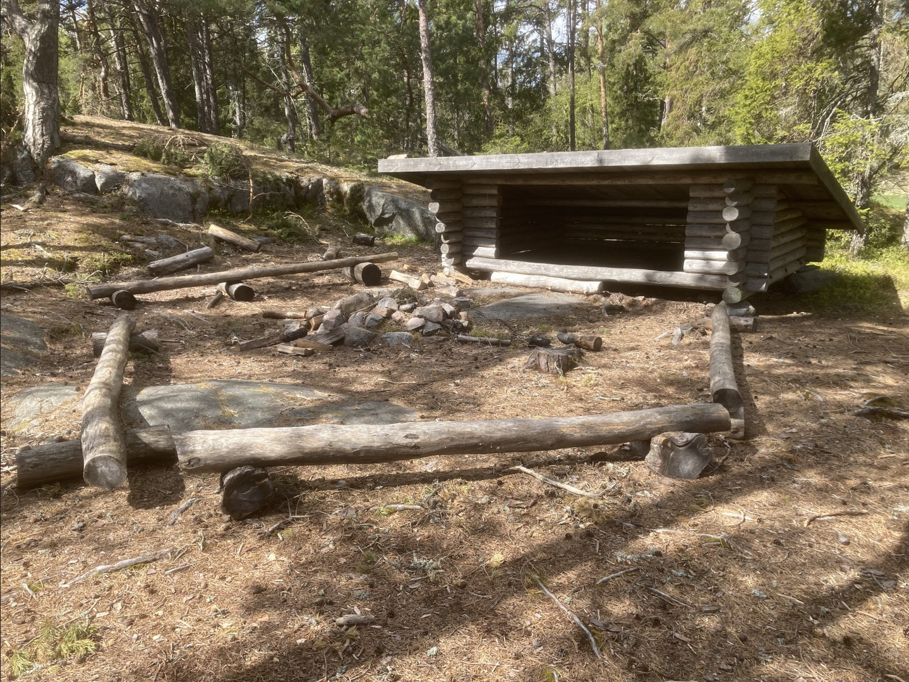

# Lägerbålsplatser och vindskydd

## Stockringar

-   ### Fårhagen
    ---
    _info_

   

-   ### Naturnäran
    ---
    Stockring i skogen på spåret Naturnäran.

   

-   ### Södra stranden
    ---
    Stockring vid stranden.

   

-   ### Lägerbålsplats
    ---
    Beskrivning

   

---

## Klipphällar

-   ### Eldorado
    
    ---

    _info_

   

---

## Vindskydd

<!-- -   ### Norra / Fladan
    
    ---

    _info_

   

-   ### Slåttskär
    
    ---

    _info_

   

-   ### Trapper
    
    ---

    _info_

    -->

-   ### Överängen
    
    ---

    Vindskydd med eldstad och stockring. Vindskyddet är cirka 3 meter brett.

   

<!-- -   ### Gjusklubben
    
    ---

    _info_

   

-   ### Garpen
    
    ---

    _info_

    -->

